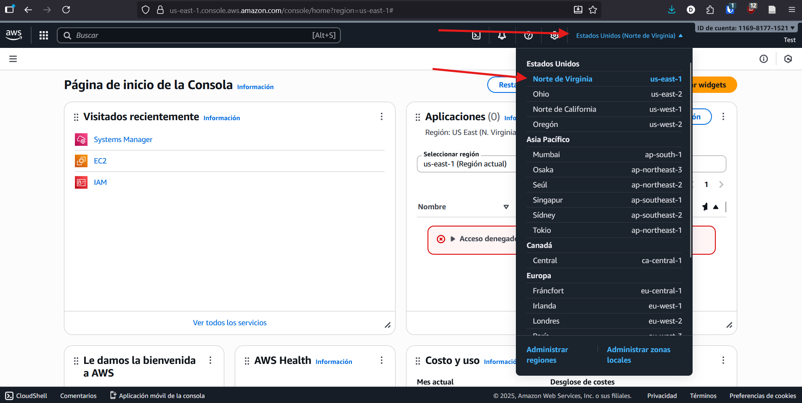
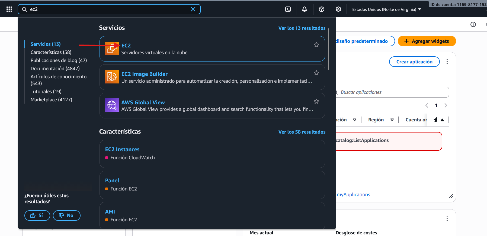
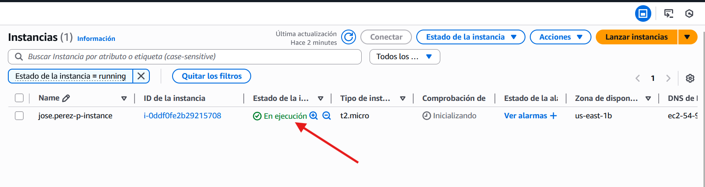
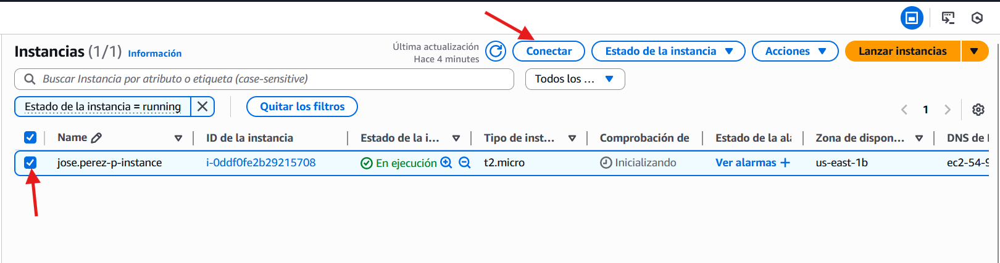
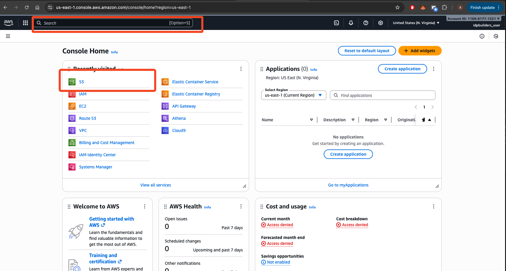
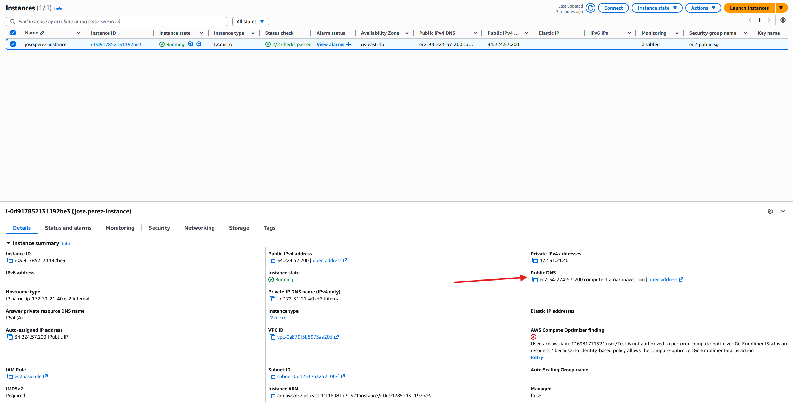
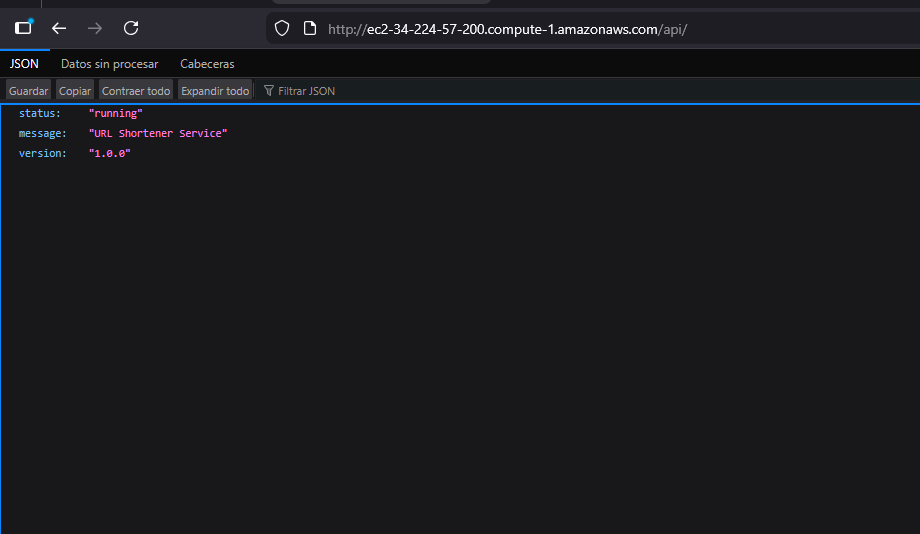

# Etapa 1: Preparación del ambiente de laboratorio

## Obtención de código fuente
1. Crear un fork del siguiente repositorio : https://github.com/AndresMarcelo7/telemetry_lab
2. Clonar el repositorio en local

## Configuración de instancia de AWS

1. Visitar la consola de [AWS](https://116981771521.signin.aws.amazon.com/console) e iniciar sesión utilizando su usuario de correo electrónico sin el dominio, (ejemplo: si su correo es `jose.perez-p@escuelaing.edu.co` entonces su usuario sería `jose.perez-p`) la contraseña será su código de estudiante (# de carnet)

2. Asegurese que la región de la cuenta sea us-east-1 - Estados Unidos (Norte de Virginia) 



3. Utilizando la barra de búsqueda de la parte superior central, diríjase al servicio de EC2



4. Dé click en lanzar instancia.


5. Diligencie los siguientes elementos:

**Información general**

- Nombre: utilice su usuario enlace para nombrar la instancia siguiendo el formato `{usuario enlace}-instance`, por ejemplo `jose.perez-p-instance`
- Imagen de máquina de Amazon (AMI) seleccione la opción `AMI de Amazon Linux 2023 kernel-6.12`
- Tipo de instancia: t2.micro

**Configuraciones de red**

- Seleccionar una grupo de seguridad existente :  utilice el grupo de seguridad `ec2-public-sg`

**Detalles avanzados**

- Perfil de instancia de IAM : seleccionar el rol `ec2basicrole`

6. Luego de click en `Lanzar instancia` , posteriormente seleccione la opción `Continuar sin un par de claves`

7. Espere hasta que el estado de la instancia sea `En ejecución`




8. Seleccione la instancia y de click en  `Conectar`



9. Seleccione la pestaña `Administrador de sesiones` y dé click en conectar


10. Una vez dentro de la instancia ejecute los siguientes comandosl. El propósito de estos comandos es 1. instalar Docker 2. hacer que el usuario que estamos usando lo pueda usar sin requerir `sudo` 3. instalar docker compose

```sh
sudo dnf update -y
sudo dnf remove -y docker docker-client docker-client-latest docker-common docker-latest docker-latest-logrotate docker-logrotate docker-engine
sudo dnf -y install dnf-plugins-core
sudo dnf config-manager --add-repo https://download.docker.com/linux/centos/docker-ce.repo
sudo sed -i 's/$releasever/9/g' /etc/yum.repos.d/docker-ce.repo
sudo dnf -y install docker-ce docker-ce-cli containerd.io docker-buildx-plugin docker-compose-plugin
sudo systemctl enable --now docker
sudo usermod -aG docker ssm-user
sudo docker compose version
```


Al finalizar el proceso debería obtener un mensaje similar al siguiente `Docker Compose version v2.40.3` . Para continuar, cierre la pestaña y vuelva a conectarse con la instancia.

## Despliegue inicial del proyecto

1. Diríjase a la consola principal de aws o a la barra de busqueda y buscar por el servicio S3.

2. Seleccionar el bucket de nombre: eci-source-code-bucket-mr

3. Crear un nuevo folder con el siguiente formato: [USUARIO-ENLACE]-code. Ej: andres.marcelo-code


4. Comprimir la carpeta `telemetry_lab` (La carpeta raiz del proyecto) del código fuente en formato .zip con el nombre `telemetry_lab.zip` y subala a s3 arrastrando el archivo sobre la interfaz. Tenga en cuenta que deberá repetir los siguientes pasos cada vez que realice modificaciones a su código 

5. obtenga la dirección del archivo al hacer click sobre `Copy S3 URI`


6. En la instancia de EC2 creada anteriormente, ejecute el siguiente comando :

 ```
 sudo mkdir -p /usr/telemetry_lab && cd /usr/telemetry_lab && sudo aws s3 cp {COPIE LA URI DE S3 AQUI} . 
 sudo unzip telemetry_lab.zip && cd telemetry_lab 
 ```

 Estos comandos  permiten 1. crear la carpeta `/usr/telemetry_lab` , 2.descargar los archivos de s3 usando el CLI de aws y 3. descompromir el archivo y navegar al contenido.

 7. Para ejecutar el proyecto, vamos a usar `docker compose` que nos permite orquestar los servicios mencionados en la arquitectura  (Nuestra app, grafana, prometheus y loki) mediante el uso de contenedores, para esto, vamos a usar el comando `docker compose up -d` . Al finalizar la ejecución del comando tendremos toda la infraestructura necesaria para el desarrollo del laboratorio.

 8. Verificar que la aplicación está ejecutando. Para esto debes volver a la consola de instancias de EC2, seleccionar tu instancia y en el panel inferior encontrarás el DNS público de la instancia, lo usaremos para acceder a nuestra aplicación. 


 

A partir del DNS obtenido, accede a la siguiente URL para obtener la información base de la aplicación: 

`http://{Public-DNS}/api/`

Deberías ver algo como esto: 




 

