# 🚀 Etapa 1: Preparación del Ambiente de Laboratorio

<div align="center">

[🏠 Inicio](./README.md) | [➡️ Siguiente: Etapa 2](./2-metricas-iniciales.md)

</div>

---

<!-- Timer Component -->
<link rel="stylesheet" href="./assets/css/timer.css">
<div id="stage-timer" data-stage-id="etapa1" data-stage-name="Etapa 1: Preparación del Ambiente"></div>
<script src="./assets/js/stage-timer.js"></script>

---

## 📦 Obtención de Código Fuente

> **Paso 1:** Preparación del repositorio

1. Crear un fork **público** del siguiente repositorio: [https://github.com/AndresMarcelo7/telemetry_lab](https://github.com/AndresMarcelo7/telemetry_lab)
2. Clonar el repositorio en local

---

## ☁️ Configuración de Instancia de AWS

1. Visitar la consola de [AWS](https://116981771521.signin.aws.amazon.com/console) e iniciar sesión utilizando su usuario de correo electrónico sin el dominio (remplazando caracteres como "." y "-" por "_"), (ejemplo: si su correo es `jose.perez-p@escuelaing.edu.co` entonces su usuario sería `jose_perez_p`) la contraseña será su usuario generado con la primera letra en Mayúscula + "\_" + código de estudiante (# de carnet) **EJEMPLO: para** `jose.perez-p@escuelaing.edu.co` **con carnet 123456 la contraseña será Jose_perez_p_123456**

2. Asegurese que la región de la cuenta sea us-east-1 - Estados Unidos (Norte de Virginia) 

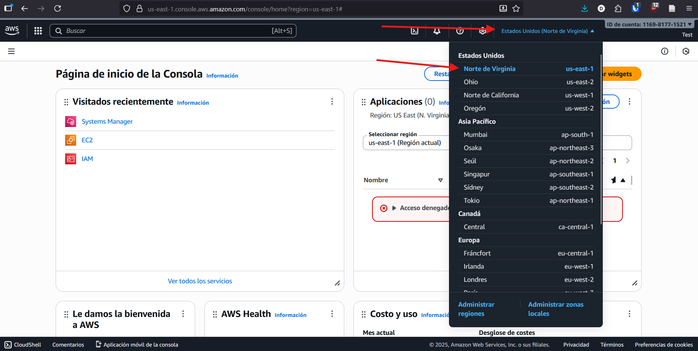

3. Utilizando la barra de búsqueda de la parte superior central, diríjase al servicio de EC2

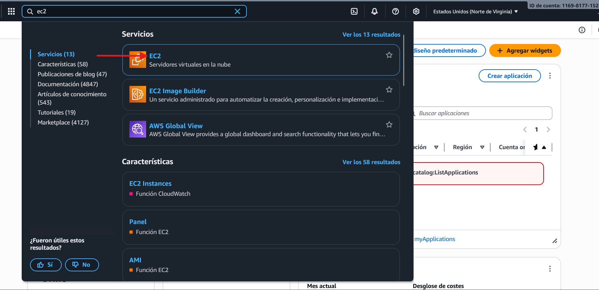

4. Dé click en lanzar instancia.

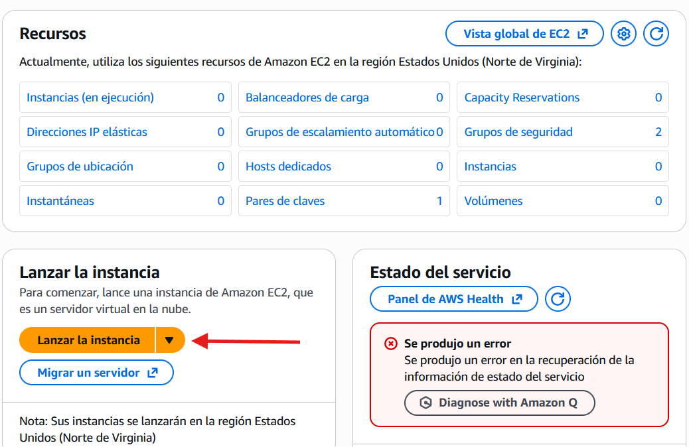

5. Diligencie los siguientes elementos:

**Información general**

- Nombre: utilice su usuario enlace para nombrar la instancia siguiendo el formato `{usuario enlace}-instance`, por ejemplo `jose.perez-p-instance`
- Imagen de máquina de Amazon (AMI) seleccione la opción `AMI de Amazon Linux 2023 kernel-6.12`
- Tipo de instancia: t2.micro

**Configuraciones de red**

- Seleccionar una grupo de seguridad existente :  utilice el grupo de seguridad `ec2-public-sg`

**Detalles avanzados**

- Perfil de instancia de IAM : seleccionar el rol `ec2basicrole`

6. Luego de click en `Lanzar instancia` , posteriormente seleccione la opción `Continuar sin un par de claves`

7. Espere hasta que el estado de la instancia sea `En ejecución`


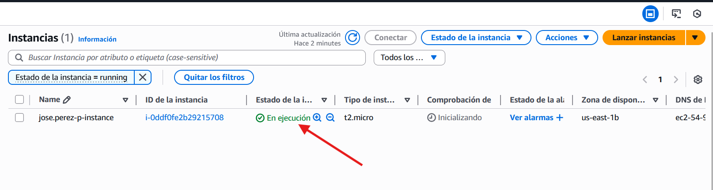

8. Seleccione la instancia y de click en  `Conectar`

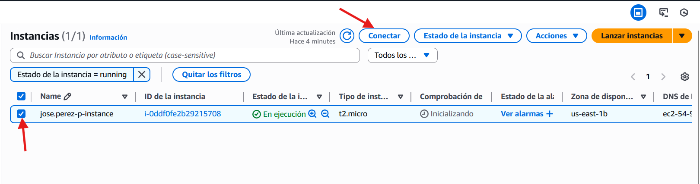

9. Seleccione la pestaña `Administrador de sesiones` y dé click en conectar

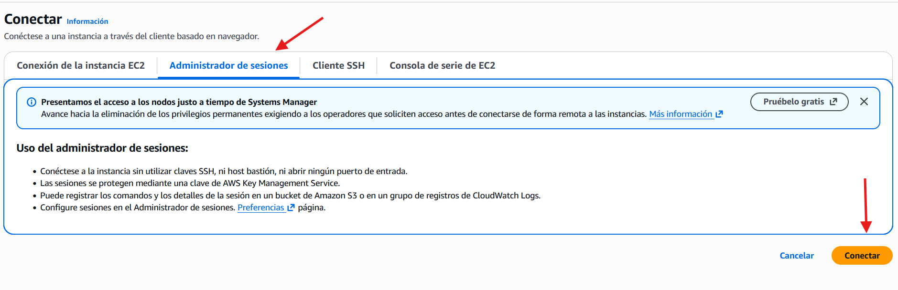


10. Una vez dentro de la instancia ejecute los siguientes comandosl. El propósito de estos comandos es 1. instalar Docker 2. hacer que el usuario que estamos usando lo pueda usar sin requerir `sudo` 3. instalar docker compose

```sh
sudo dnf update -y
sudo dnf remove -y docker docker-client docker-client-latest docker-common docker-latest docker-latest-logrotate docker-logrotate docker-engine
sudo dnf -y install dnf-plugins-core
sudo dnf config-manager --add-repo https://download.docker.com/linux/centos/docker-ce.repo
sudo sed -i 's/$releasever/9/g' /etc/yum.repos.d/docker-ce.repo
sudo dnf -y install docker-ce docker-ce-cli containerd.io docker-buildx-plugin docker-compose-plugin
sudo systemctl enable --now docker
sudo usermod -aG docker ssm-user
sudo docker compose version
```


Al finalizar el proceso debería obtener un mensaje similar al siguiente `Docker Compose version v2.40.3` . Para continuar, cierre la pestaña y vuelva a conectarse con la instancia.

---

## 🐳 Despliegue Inicial del Proyecto

1. Diríjase a la consola principal de aws o a la barra de busqueda y buscar por el servicio S3.
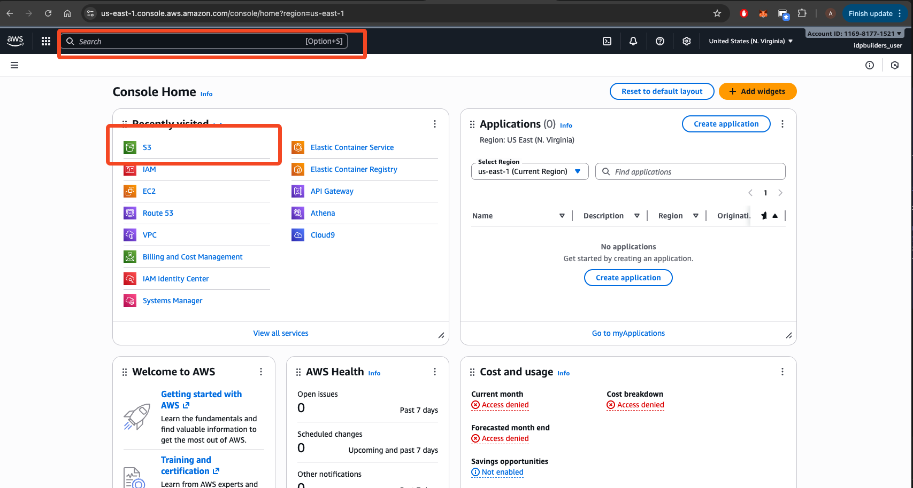
2. Seleccionar el bucket de nombre: eci-source-code-bucket-mr
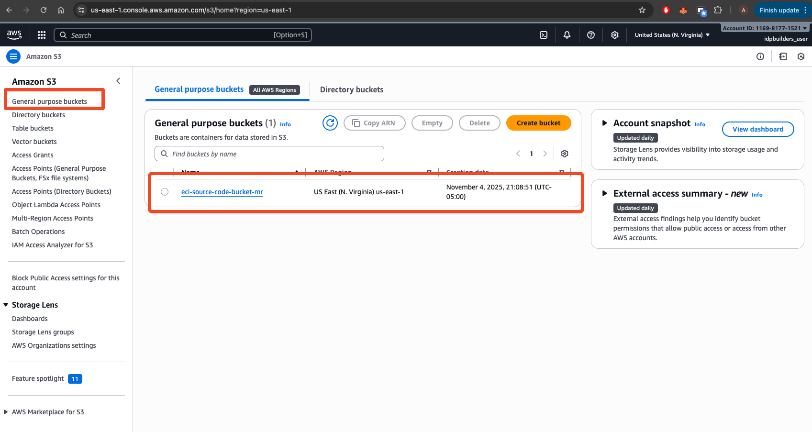
3. Crear un nuevo folder con el siguiente formato: [USUARIO-ENLACE]-code. Ej: andres.marcelo-code
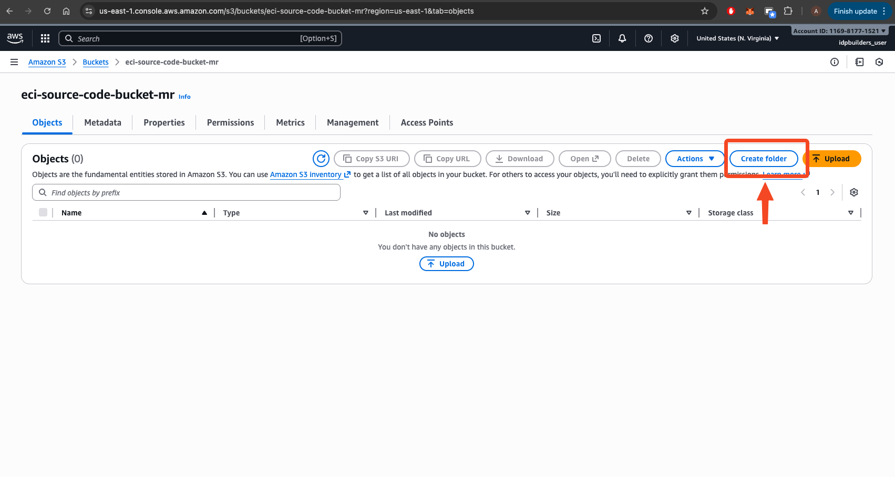
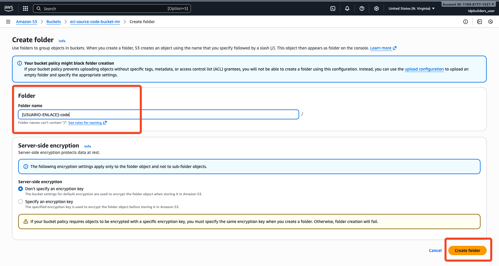
4. Comprimir la carpeta `telemetry_lab` (La carpeta raiz del proyecto) del código fuente en formato .zip con el nombre `telemetry_lab.zip` y subala a s3 arrastrando el archivo sobre la interfaz. Tenga en cuenta que deberá repetir los siguientes pasos cada vez que realice modificaciones a su código 
5. obtenga la dirección del archivo `.zip` al hacer click sobre `Copy S3 URI`
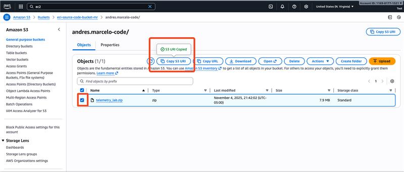
6. En la instancia de EC2 creada anteriormente, ejecute el siguiente comando :
 ```
 sudo mkdir -p /usr/telemetry_lab && cd /usr/telemetry_lab && sudo aws s3 cp {COPIE LA URI S3 DEl ARCHIVO .ZIP AQUI} . 
 sudo unzip telemetry_lab.zip && cd telemetry_lab 
 ```
 Estos comandos  permiten 1. crear la carpeta `/usr/telemetry_lab` , 2.descargar los archivos de s3 usando el CLI de aws y 3. descompromir el archivo y navegar al contenido.
7. Para ejecutar el proyecto, vamos a usar `docker compose` que nos permite orquestar los servicios mencionados en la arquitectura  (Nuestra app, grafana, prometheus y loki) mediante el uso de contenedores, para esto, vamos a usar el comando `docker compose up --build -d` . Al finalizar la ejecución del comando tendremos toda la infraestructura necesaria para el desarrollo del laboratorio.
8. Verificar que la aplicación está ejecutando. Para esto debes volver a la consola de instancias de EC2, seleccionar tu instancia y en el panel inferior encontrarás el DNS público de la instancia, lo usaremos para acceder a nuestra aplicación.

> **💡 Nota importante:**
> Los pasos **4–8 deben repetirse cada vez que se quiera cambiar el código dentro de la instancia**.  
> Esto será necesario en secciones posteriores.

 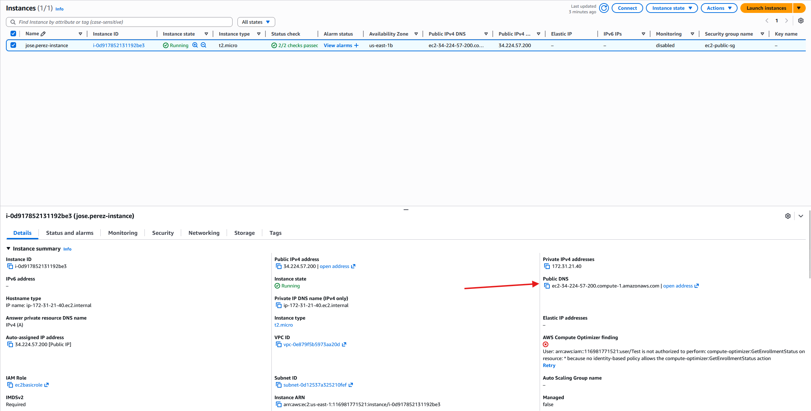

A partir del DNS obtenido, accede a la siguiente URL para obtener la información base de la aplicación: 

`http://{Public-DNS}/api/`

Deberías ver algo como esto: 

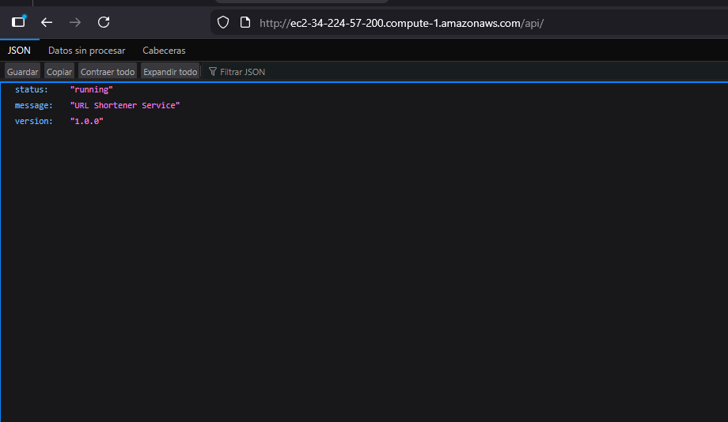

---

 ---

### Explicación del archivo `docker-compose.yml`

A continuación se detalla qué hace cada sección del archivo `docker-compose.yml`, qué servicios se despliegan y en qué puertos estarán disponibles.

---

#### Redes

```yaml
networks:
  telemetry:
    name: telemetry
    driver: bridge
```

Esta sección crea una red Docker llamada **telemetry**.  
Todos los servicios se conectan a esta red para poder comunicarse entre sí utilizando nombres de servicio.

---

#### Servicio: Aplicación Java

```yaml
  java-application:
    build:
      context: java-application
      dockerfile: Dockerfile
    container_name: java-application
    ports:
      - "80:8080"
    networks:
      - telemetry
```

- Construye y ejecuta la aplicación Java del laboratorio.  
- Expone el **puerto 8080 interno** en el **puerto 80** del servidor EC2.  
- La aplicación será accesible desde el navegador mediante:
```
http://{Public-DNS}
```
- En la siguiente imagen se muestra  la configuración del archivo  `application.properties` de `SpringBoot`,  esto permite que la aplicación  exponga las métricas por medio del endpoint `/actuator/prometheus`. Adicionalmente contiene algunas configuraciones con respecto al nivel y formato de logs.

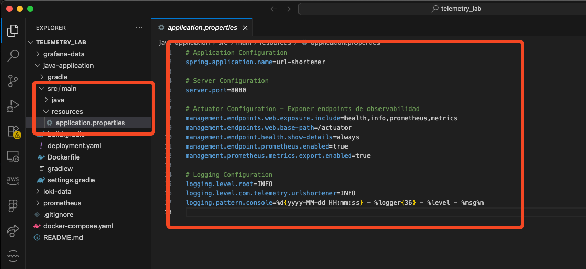

> **💡 Nota importante:** Estas configuraciones ya vienen incluidas en el proyecto, por lo que no necesitas modificarlas. Sin embargo, es importante que entiendas qué hacen, ya que son la base para todo el monitoreo que implementarás en las siguientes etapas.

---

#### Servicio: Prometheus

```yaml
  prometheus:
    container_name: prometheus-svc
    image: prom/prometheus:v3.3.0
    ports: 
      - "9091:9090"
    volumes:
      - ./prometheus/prometheus.yaml:/etc/prometheus/prometheus.yaml
    command: --config.file=/etc/prometheus/prometheus.yaml
    networks:
      - telemetry
```

- Prometheus recolecta métricas expuestas por la aplicación y otros servicios.  
- Utiliza el archivo `./prometheus/promehteus.yaml` para especificar una configuración personalizada (Targets de monitoreo).  
- Se expone en el puerto **9091** del host.

---

#### Servicio: Loki (Logs)

```yaml
  loki:
    image: grafana/loki:2.9.4
    container_name: loki
    command: -config.file=/etc/loki/loki.yaml
    volumes:
      - ./loki-data/loki.yaml:/etc/loki/loki.yaml
    ports:
      - "3100:3100"
      - "9096:9096"
    networks:
      - telemetry
```

- Loki recibe y almacena los logs enviados por Promtail.  
- Expone su API en el puerto **3100** y sus métricas internas en **9096**.

---

#### Servicio: Promtail

```yaml
  promtail:
    image: grafana/promtail:2.9.4
    container_name: promtail
    volumes:
      - /var/lib/docker/containers:/var/lib/docker/containers:ro
      - /var/run/docker.sock:/var/run/docker.sock:ro
      - ./loki-data/promtail-config.yaml:/etc/promtail/config.yaml
    command: -config.file=/etc/promtail/config.yaml
    depends_on:
      - loki
    networks:
      - telemetry
```

- Promtail actúa como agente recolector de logs.  
- Lee los logs de los contenedores Docker del sistema.  
- Envía estos logs hacia Loki.  
- No expone puertos hacia el exterior.

---

#### Servicio: Grafana

```yaml
  grafana:
    image: grafana/grafana:11.6.1
    ports:
      - "3000:3000"
    environment:
      - GF_AUTH_BASIC_ENABLED=false
      - GF_AUTH_ANONYMOUS_ENABLED=true
      - GF_AUTH_ANONYMOUS_ORG_ROLE=Admin
      - GF_PATHS_PROVISIONING=/etc/grafana/provisioning
    volumes:
      - grafana-storage:/var/lib/grafana
    networks:
      - telemetry
```

- Grafana permite visualizar métricas y logs del sistema.  
- Se expone en el puerto **3000**.

Acceso:

```
http://{Public-DNS}:3000
```

---

#### Volúmenes

```yaml
volumes:
  grafana-storage:
```

El volumen **grafana-storage** permite persistir dashboards, configuraciones y datos de Grafana incluso si el contenedor es reiniciado.

---

## ✅ Verificación del Ambiente

Si llegaste hasta aquí y puedes ver la aplicación corriendo en tu navegador, **¡felicidades!** Has completado exitosamente la preparación del ambiente.

> **💡 Consejo:** Guarda el DNS público de tu instancia, lo necesitarás durante todo el laboratorio.

**Registra en tu bitácora(La puedes encontrar en la ruta /docs/Bitacora.md de tu repositorio):**
- ✍️ DNS público de tu instancia EC2
- 📸 Captura de pantalla de la aplicación funcionando
- 📝 Cualquier problema encontrado y cómo lo resolviste

---

## 📍 Próximos Pasos

Ahora que tu ambiente está configurado, es momento de explorar las métricas que expone la aplicación.


---

<div class="finish-stage-container">
  <button id="finish-stage-btn" class="finish-stage-btn" data-next-url="./2-metricas-iniciales">
    ✅ Finalizar Etapa y Continuar ➡️
  </button>
  <p class="finish-stage-info">
    💾 Al hacer clic, tu tiempo será guardado automáticamente y continuarás a la siguiente etapa
  </p>
</div>


