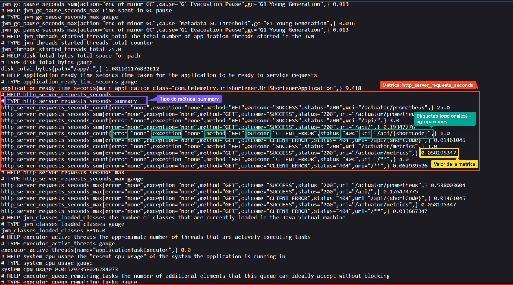

# 📊 Etapa 2: Configuración y Exploración de Métricas

<div align="center">

[]()
[]()
[]()

[⬅️ Anterior: Etapa 1](./1-preparacion_ambiente-noidp.md) | [🏠 Inicio](./main.md) | [➡️ Siguiente: Etapa 2.1](./3-grafana-dashboard-base.md)

</div>

---

## 🎯 Objetivo

Analizar las métricas expuestas por la aplicación Java y verificar su recolección en Prometheus.

---

## 📋 Instrucciones

### 1️⃣ Generar Actividad en la Aplicación
Antes de observar las métricas, debes generar tráfico hacia la aplicación para producir datos y logs iniciales.

1. Abre tu navegador y accede al endpoint principal de la aplicación: `http://{Public-DNS}/`

2. Realiza varias solicitudes a diferentes rutas de la API.  Los endpoints disponibles son :

    1. **`GET /api/`**  
    - **Descripción:** Devuelve el estado general del servicio.  
    - **Ejemplo:**  
        ```
        curl http://{Public-DNS}/api/
        ```

    2. **`POST /api/shorten`**  
    - **Descripción:** Crea una URL acortada a partir de un JSON con la URL original.  
    - **Entrada esperada:**
        ```json
        {
        "url": "https://example.com",
        "customCode": "opcional"
        }
        ```
    - **Ejemplo:**  
        ```
        curl -X POST http://{Public-DNS}/api/shorten \
        -H "Content-Type: application/json" \
        -d '{"url": "https://google.com"}'
        ```

    3. **`GET /api/{shortCode}`**  
    - **Descripción:** Redirige a la URL original asociada a un código corto.   
    - **Ejemplo:**  
        ```
        curl -I http://{Public-DNS}/api/abc123
        ```

    4. **`GET /api/urls`**  
   - **Descripción:** Retorna todas las URLs almacenadas en memoria.  
   - **Ejemplo:**  
     ```
     curl http://{Public-DNS}/api/urls
     ```

---

3. Espera unos segundos para que las métricas se actualicen en el endpoint de Prometheus

---

### 2️⃣ Explorar las Métricas Expuestas por la Aplicación

El microservicio Java expone sus métricas en formato Prometheus a través del endpoint `/actuator/prometheus`. Estas métricas reflejan distintos aspectos del comportamiento de la aplicación, tales como rendimiento, latencia y errores.

1. Abre el endpoint de métricas en tu navegador `http://{Public-DNS}/actuator/prometheus`. Deberías encontrar algo como lo que se muestra en la siguiente imagen :


En la imagen se resaltan los distintos elementos que expone prometheus sobre cada metrica, como el nombre, el tipo, las etiquetas el valor y descripción. 


2. Examina el contenido del endpoint y busca métricas relacionadas con:
- Número de solicitudes HTTP 
- Latencia o duración de las solicitudes 
- Códigos de estado HTTP 
- Uso de memoria o CPU

3. En tu bitácora de laboratorio:

   - Selecciona tres métricas relevantes y describe qué información aportan sobre el sistema.
     - Menciona qué tipo de métrica es (gauge, counter, histograma, summary)
     - Con qué otras métricas podría estar relacionada (si aplica)? Por ejemplo, un aumento en peticiones podría influir en el uso de CPU
     - En qué escenarios puede ayudar esta métrica?
     - Qué etiquetas se utilizan para agrupar los datos (si aplica)?

---

## ✅ Verificación

**Asegúrate de haber completado:**
- ☑️ Generado tráfico hacia todos los endpoints de la API
- ☑️ Accedido al endpoint `/actuator/prometheus`
- ☑️ Identificado al menos 3 métricas relevantes
- ☑️ Documentado el análisis en tu [bitácora](../Bitacora.md)

> **💡 Tip:** Las métricas que selecciones te servirán para crear visualizaciones en la siguiente etapa.

---

## 📍 Próximos Pasos

Ahora que comprendes las métricas que expone la aplicación, es momento de visualizarlas en Grafana.

### ➡️ [Continuar a la Etapa 2.1: Dashboard Base en Grafana](./3-grafana-dashboard-base.md)

---

<div align="center">

[⬅️ Anterior: Etapa 1](./1-preparacion_ambiente-noidp.md) | [🏠 Inicio](./main.md) | [➡️ Siguiente: Etapa 2.1](./3-grafana-dashboard-base.md)

</div>
