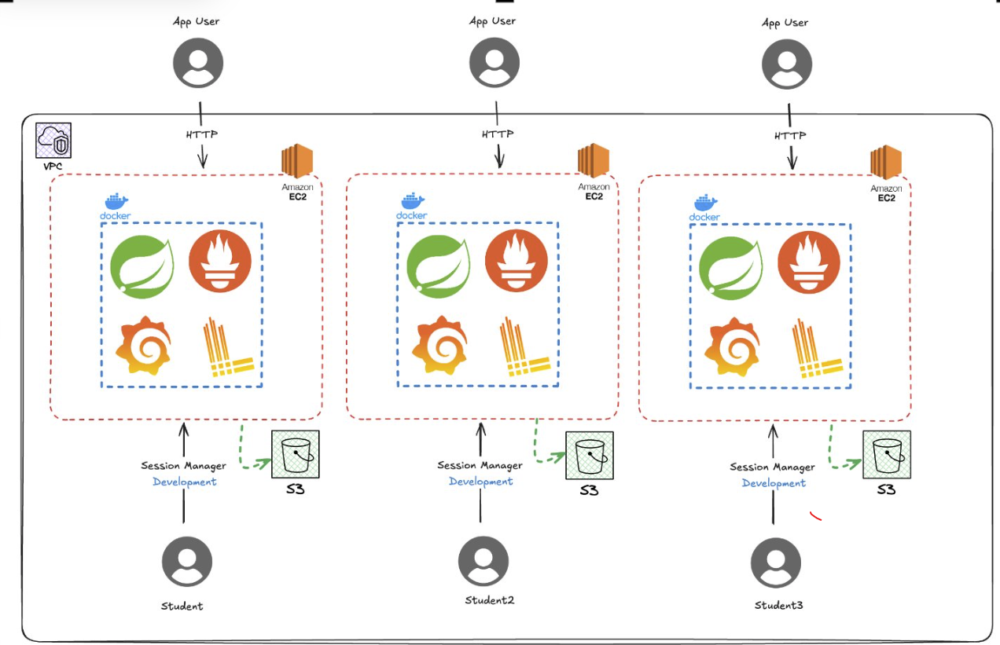

# 🔬 Taller de Telemetría y Observabilidad en Entornos DevOps

> **Bienvenido al laboratorio de observabilidad**  
> Este taller te guiará a través de la implementación práctica de métricas, logs y dashboards usando Prometheus, Grafana y Loki.

---

## ⏱️ Duración Estimada del Experimento

> **💡 Tip para medir tu tiempo:**  
> Esta página incluye una utilidad para medir el tiempo empleado en cada etapa, asegurate de iniciar el cronómetro al prinicipio de cada etapa y de pulsar
el boton de finalizar etapa.

## 🎯 Objetivos del Taller

Al finalizar este laboratorio, serás capaz de:

- ✅ **Desplegar** una aplicación instrumentada con telemetría en un entorno cloud
- ✅ **Analizar** métricas expuestas por aplicaciones usando Prometheus
- ✅ **Construir** dashboards interactivos en Grafana para visualizar el comportamiento del sistema
- ✅ **Implementar** métricas personalizadas basadas en el dominio de negocio
- ✅ **Detectar** anomalías y correlacionar eventos usando métricas y logs
- ✅ **Aplicar** el método científico para diagnosticar y corregir problemas

---

## 🏗️ Arquitectura Utilizada

Este laboratorio utiliza los siguientes componentes:

Cada estudiante dispone de una aplicación Java, que ya está configurada para exponer métricas mediante el endpoint `actuator/prometheus`. Adicionalmente se incluye un archivo docker-compose para 
facilitar el despliegue de la aplicación junto con los componentes relacionados a la recolección y visualización de métricas y logs.

El archivo docker-compose permite crear los siguientes componentes:
1. Loki se encarga de la recolección y almacenamiento de logs de las aplicaciones de los estudiantes
2. Prometheus se encarga de la recolección y almacenamiento de métricas de las aplicaciones de los estudiantes
3. Grafana se integra con Loki y Prometheus para permitir la creación de visualizaciones a partir de los datos almacenados. 

Para el despliegue de la aplicación, cada estudiante cuanta con un usuario en AWS con el que podrán crear una máquina de EC2 ,
adicionalmente, podrán hacer uso de S3 para almacenar el código y descargarlo desde la instancia. Cada instancia esta configurada con
`Session Manager` que permite al estudiante ingresar a la consola de control de la instancia desde la interfaz web de AWS.

---

## Tips para desarrollar el laboratorio

1. **Sigue el orden:** Completa las etapas en secuencia (no saltes pasos)
2. **Experimenta:** No tengas miedo de explorar más allá de las instrucciones

**¿Listo para comenzar?** 👇

### ➡️ [**Comenzar con la Etapa 1: Preparación del Ambiente**](./1-preparacion_ambiente-noidp.md)

---

## 📖 Recursos Adicionales

- 📚 [Documentación de Prometheus](https://prometheus.io/docs/)
- 📚 [Documentación de Grafana](https://grafana.com/docs/)
- 📚 [PromQL Cheat Sheet](https://promlabs.com/promql-cheat-sheet/)
- 📚 [LogQL Guide](https://grafana.com/docs/loki/latest/logql/)
- 📚 [Spring Boot Actuator Metrics](https://docs.spring.io/spring-boot/docs/current/reference/html/actuator.html#actuator.metrics)

---

**¡Buena suerte y disfruta el laboratorio! 🎉**

