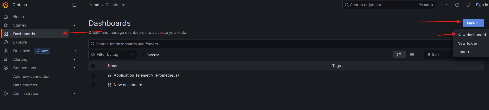
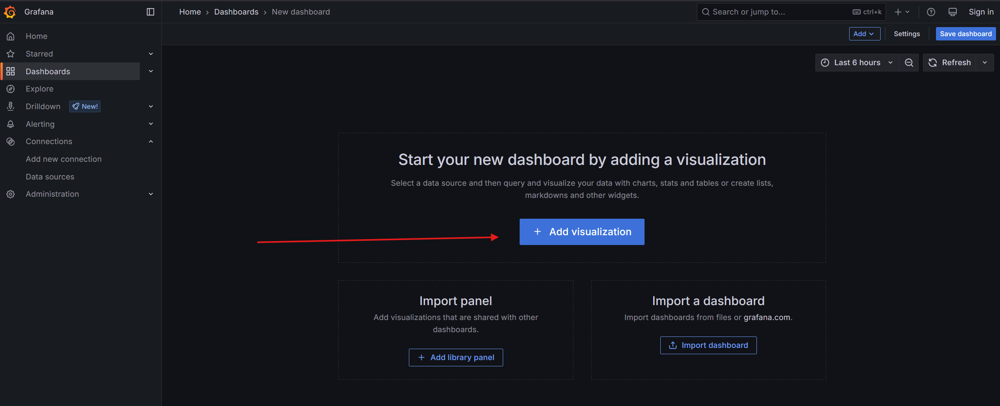
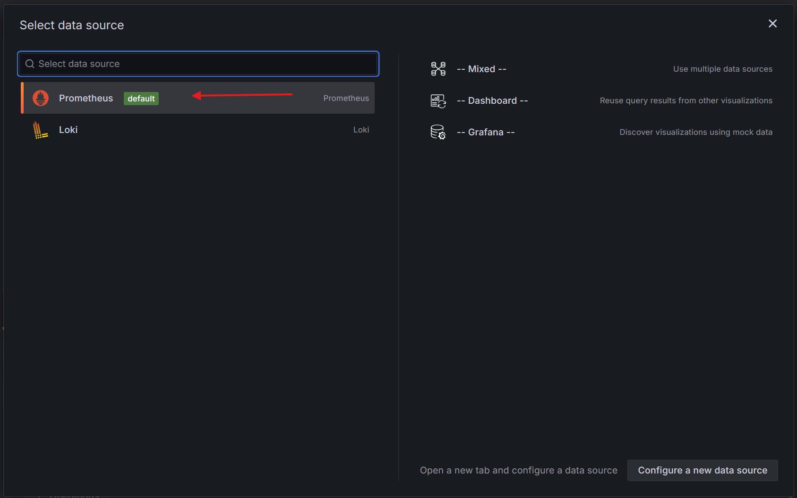
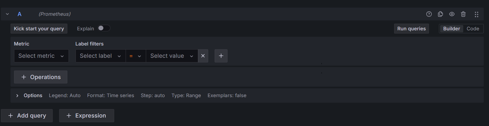
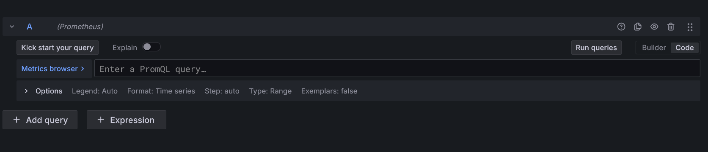
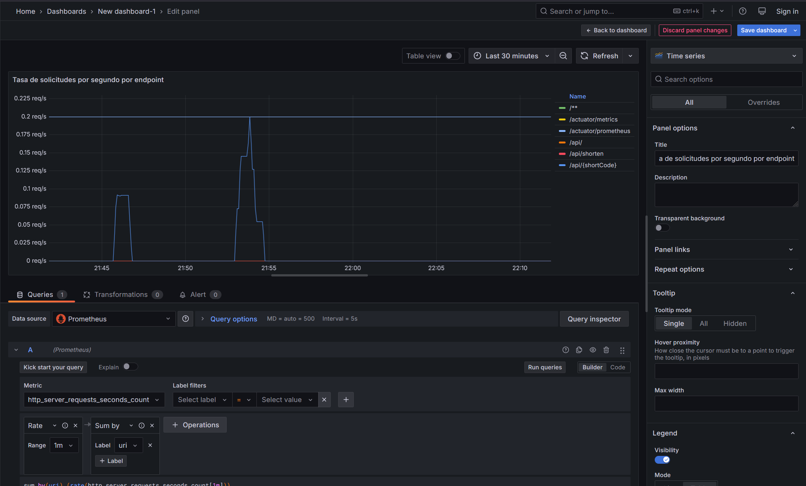
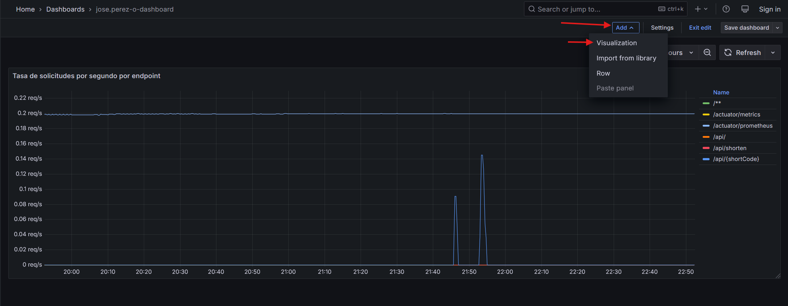
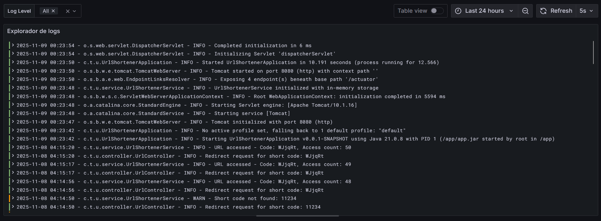
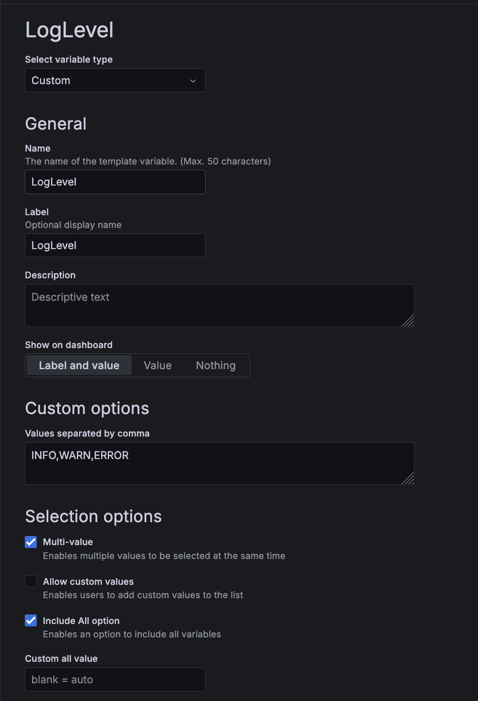
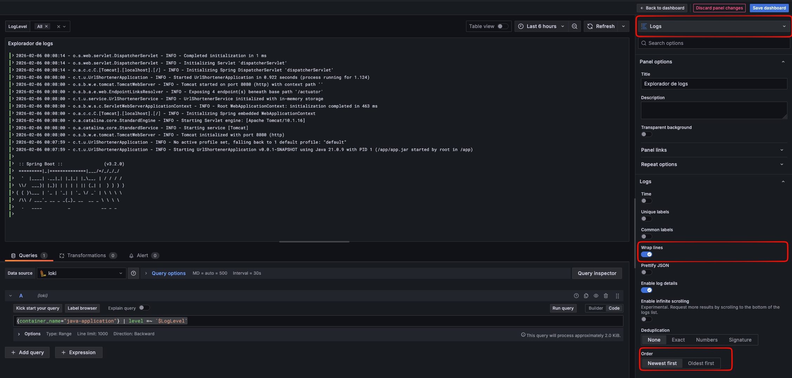

# Etapa 2.1 – Creación del Dashboard Base en Grafana

## Objetivo
Construir un dashboard en Grafana que permita visualizar y analizar las métricas recolectadas por Prometheus y los logs procesados por Loki, comprendiendo cómo reflejan el comportamiento del sistema en términos de rendimiento, latencia y errores.

---

## 1. Acceso a Grafana

1. Ingresa a la interfaz web de Grafana `http://<grafana-url>/`
2. En el menú lateral, selecciona **“Dashboard”** y luego haz clic en **“new”**. Finalmente, haz clic en **"Add Visualization"**






## 2. Panel 1 – Solicitudes procesadas por endpoint

### Propósito
Crear la **primera visualización** en Grafana a partir de una métrica de Prometheus.  

**En este panel queremos observar la tasa de solicitudes por segundo agrupada por cada endpoint (uri).**

---

### Paso 1: Seleccionar Datasource

1. Seleccionar `Prometheus` como **Data source** en la parte superior.



---

### Paso 2: Conocer las dos formas de construir una consulta

Grafana ofrece **dos modos de creación de consultas** 

1. **Query Builder (constructor visual):**
- Permite seleccionar las métricas y etiquetas desde menús desplegables sin necesidad de escribir código.
- Ideal para principiantes o cuando no se recuerda la sintaxis exacta.
- Puedes filtrar, agregar operaciones como `sum`, `rate`, `avg` y agrupar por etiquetas (`by`).

2. **Code mode (modo código):**
- Permite escribir directamente la consulta  usando el lenguaje PromQL.
- Ideal para tener control total y combinar funciones más complejas.

Ambos modos producen el mismo resultado. Puedes cambiar entre ellos usando el botón **“Code / Builder”** sobre el campo de la consulta.

**Builder mode**


**Code mode**


---

### Paso 3: Escribir la consulta

En **Code Mode**, escribe la siguiente consulta PromQL:

```promql
sum by (uri) (rate(http_server_requests_seconds_count[1m]))
```

Si prefieres usar el Query Builder, selecciona:

```
Metric: http_server_requests_seconds_count
Operation: Range functions -> Rate() con rango de 1m
Aggregate: Aggregate functions -> sum + `By label` uri
```


### Paso 4: Configurar la visualización

En el panel derecho de Grafana encontrarás varias secciones con opciones que te permiten personalizar la visualización.
Estas son las principales:

Visualization: el tipo de gráfico (líneas, barras, gauge, tabla, etc.).

Panel options: título, descripción y unidades de medida.

Field options: formato de valores, colores, y límites de ejes.

Legend: cómo se muestran los nombres de las series (por ejemplo, mostrar el uri).

Recomendaciones

Elige `Time series` como tipo de visualización.

Cambia el título del panel a: `Tasa de solicitudes por segundo por endpoint`

Activa la leyenda y selecciona  _Mode_ `Table` y _Placement_ `Right` para mostrar los endpoints a la derecha.

En la opción _Unit_ utiliza el valor _Throughput_ -> Requests/sec (rps)

Explora libremente las demás opciones del panel: Grafana te permite ajustar escalas, colores y estilos.

No tengas miedo de experimentar: la mejor forma de aprender es modificar y observar cómo cambia el gráfico.

Al final deberías ver algo como esto 



Una vez terminado, guarda el dashboard, asigna un nombre incluyendo tu nombre de usuario. Por ejemplo `jose.perez-o-dashboard`

## 3. Panel 2 – Latencia promedio de solicitudes

Desde la vista de dashboard, usa la opción `Add` y luego la opción `Visualization` para añadir nuevos paneles.




### Título sugerido
**Latencia promedio de respuesta por endpoint(s)**
### Interpretación 
Este panel muestra cuánto tarda la aplicación, en promedio, en responder a las solicitudes por cada endpoint.
Una latencia estable y baja indica buen rendimiento; picos pueden sugerir saturación, procesamiento intensivo o problemas en la base de datos.
### Query PromQL

```promql
sum by(uri) (rate(http_server_requests_seconds_sum[1m])) / sum by(uri) (rate(http_server_requests_seconds_count[1m]))
```
### Configuraciones recomendadas

**Tipo de visualización recomendado** : 
-  **Time series** para observar su evolución temporal.
- Alternativamente,**Gauge** o **Stat panel** : Muestra el valor promedio actual de latencia en segundos.


**Unidad**: segundos (s)

**Rangos de color:** ( Crear thresholds)

- Verde: < 0.2 s 

- Amarillo: 0.2 – 0.5 s 

- Rojo: > 0.5 s

**Nota:** Usualmente la latencia se mide utilizando histogramas en lugar de calcular simplemente el promedio, observando, por ejemplo el p99 de la latencia, o algun percentil de interés. Para más información sobre cómo añadir los histogramas a la aplicación puedes revisar este [blog](https://coderstower.com/2022/05/30/spring-boot-observability-validating-tail-latency-with-percentiles/) .


## 4. Panel 3 – Errores de aplicación (HTTP 4xx / 5xx)

### Título sugerido
**Tasa de errores de aplicación (HTTP 4xx / 5xx)**

### Propósito
Visualizar la frecuencia de errores que ocurren en la aplicación, diferenciando entre:
- **Errores 4xx:** solicitudes inválidas o mal formadas (fallos del cliente).
- **Errores 5xx:** fallos internos del servidor o la lógica de negocio.

Este panel permitirá  detectar momentos en los que la aplicación falla y relacionarlos con cambios en la carga o en la latencia.

---

### Query PromQL
```promql
sum by (status,uri) ( rate(http_server_requests_seconds_count{status=~"4..|5.."}[1m])
)
```

### Otros ajustes

**Unit** Requests per second

**Tipo de visualización recomendado** : 
-  **Time series** para observar su evolución temporal.

Aplica los ajustes de visualización que consideres necesarios

## 5. Panel 4 – Visualización de logs de aplicación (Loki)

### Título sugerido
**Explorador de logs**

---

### Propósito
Observar los **logs generados por la aplicación Java** en tiempo real, filtrarlos por nivel de severidad (`INFO`, `WARN`, `ERROR`) y relacionarlos con las métricas vistas en los paneles anteriores.



---

### Paso 1: Crear la variable `$LogLevel`

1. En la parte superior del dashboard, haz clic en el ícono ⚙️ **(Settings)** → **Variables** → **Add variable**.  
2. Configura los siguientes campos:

| Campo | Valor |
|-------|-------|
| **Name** | `LogLevel` |
| **Label** | `LogLevel` |
| **Type** | `Custom` |
| **Values separated by commas** | `INFO, WARN, ERROR` |
| **Include All option** | ✅ Activado |
| **Multi-value** | ✅ Activado |

3. Haz clic en **Add** y luego en **Save dashboard**.

Esta variable permitirá filtrar dinámicamente el nivel de logs visualizado desde un menú desplegable en la parte superior del dashboard.


---

### Paso 2: Crear el panel de logs

1. Desde el dashboard, selecciona **“Add panel”** y elige la fuente de datos `Loki`.
2. En el campo de consulta, escribe la siguiente **query LogQL**:

```logql
{container_name="java-application"} 
| regexp `(?P<timestamp>\d{4}-\d{2}-\d{2} \d{2}:\d{2}:\d{2}) - (?P<logger>[\w.$]+) - (?P<level>[A-Z]+) - (?P<msg>.*)` 
| level =~ `$LogLevel`
```

**Interpretación de la consulta:**

Muestra todos los logs generados por el contenedor java-application,
extrayendo la fecha, el logger, el nivel de severidad y el mensaje de cada línea,
y filtrando dinámicamente según el nivel seleccionado en $LogLevel.


### Paso 3: Configuración de visualización

**Tipo**: Logs panel

**Opciones recomendadas:**

* Activar “Show context” (para ver líneas antes y después del evento).

* Activar “Wrap lines” (para leer mensajes largos).

* Ordenar por timestamp descendente.





# Extensión del laboratorio – Creación de visualizaciones adicionales

Ahora que ya configuraste tu dashboard base y los paneles principales (solicitudes, latencia, errores y logs), es momento de **explorar por tu cuenta las métricas y datos disponibles** para crear tus propias visualizaciones.

El objetivo es que practiques la interpretación de métricas y aprendas a elegir representaciones adecuadas para comunicar el estado y comportamiento del sistema.

---


## 5. Extensión del dashboard – Creación de visualizaciones adicionales

Hasta este punto has construido el **dashboard base**, con paneles que muestran las solicitudes, la latencia, los errores y los logs de la aplicación.  
Ahora usarás las métricas restantes disponibles en Prometheus y los datos de Loki para **ampliar tu dashboard** con tus propias visualizaciones.

---

### 5.1 Instrucciones

Diseña **al menos tres nuevas visualizaciones** que complementen las ya existentes.  
Para cada una, define:

- **Propósito:** qué quieres analizar o mostrar.  
- **Título del panel:** un nombre claro y descriptivo.  
- **Query:** la expresión PromQL o LogQL que usarás.  
- **Tipo de visualización:** *Time series*, *Gauge*, *Bar chart*, *Stat*, *Logs*, entre otros.  
- **Ajustes opcionales:** colores, unidades, leyenda, rango de tiempo o frecuencia de actualización.  
- En tu bitácora del laboratorio, agrega un breve comentario por cada panel adicional (2–3 frases) donde expliques:
    - Qué información aporta.  
    - Qué conclusiones o patrones observas.

### 5.2 Recomendaciones

- Explora las métricas disponibles en `actuator/prometheus`, adicionalmente puedes proponer nuevas visualizaciones de las métricas que ya se han utilizado si las consideras relevantes para monitorear la aplicación. 
- Si usas **Loki**, puedes aplicar expresiones regulares y filtros para contar, agrupar o visualizar logs específicos (por ejemplo, errores, advertencias o mensajes informativos).  
- Usa el **modo Builder** si prefieres construir consultas desde menús, o el **modo Code** para escribir las expresiones directamente.  Si deseas, apoyate de modelos LLM para generar las consultas a partir del propósito previamente definido.
- Ajusta los **colores y unidades** para que los datos sean fáciles de leer (por ejemplo, convertir bytes a MB o segundos a milisegundos).  
- Prueba diferentes **tipos de panel** hasta encontrar la visualización que mejor comunique el comportamiento observado.  

### 5.3 Análisis final

- ¿Qué comportamiento del sistema pudiste observar que no era evidente en el dashboard inicial?  
- ¿Qué métricas se relacionan entre sí? (por ejemplo, CPU con latencia, memoria con errores, etc.)  
- ¿Qué indicadores te parecerían útiles para detectar fallos antes de que afecten a los usuarios?  
- ¿Qué otros datos te gustaría visualizar si tuvieras más información disponible?